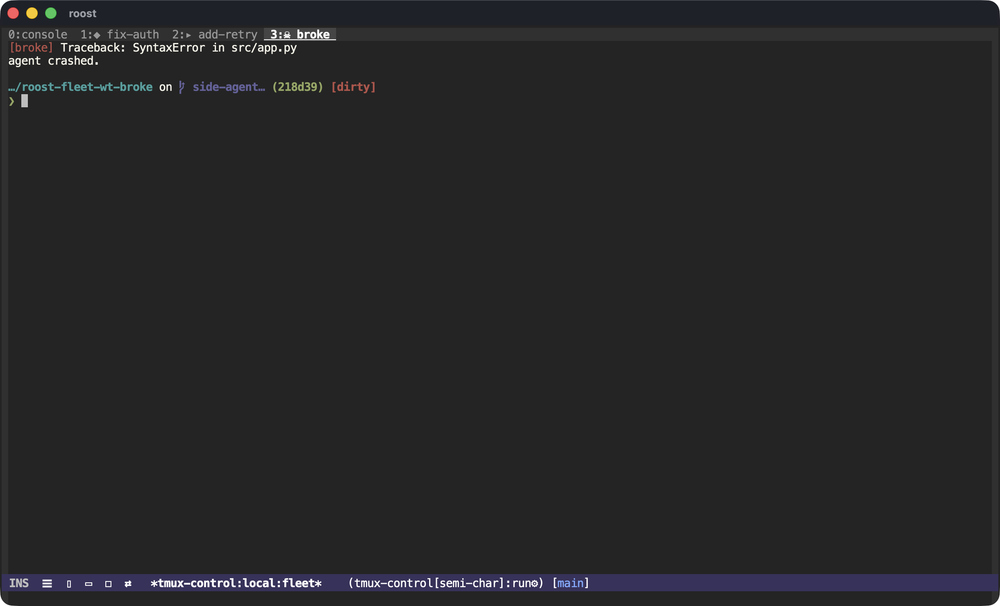
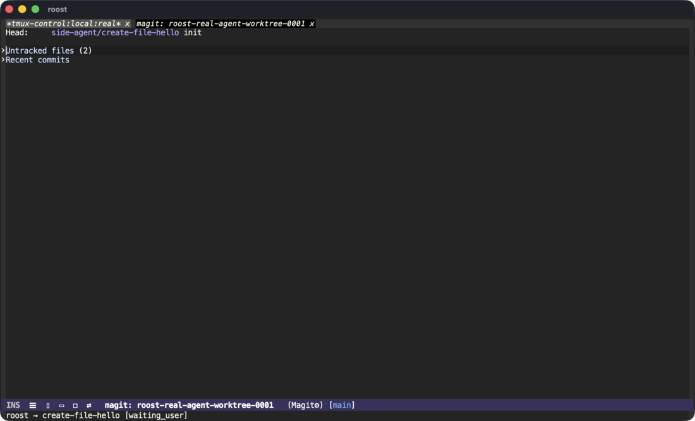

# roost

**The perch from which you watch and direct a flock of coding agents — in Emacs.**

Background agent frameworks that drive **tmux** run each agent in its own tmux
window and git worktree, and record their lifecycle in a small registry.
[`tmux-control`](https://github.com/csheaff/tmux-control) already renders those
tmux windows as live Emacs buffers. Roost is the thin layer that turns *watching*
into *acting*: it reads the registry and, leaning entirely on tmux-control to do
the rendering, lets you jump to the agent that wants you, review its branch, and
see who-is-doing-what at a glance.



*The window tab bar, fed by roost: `◆ fix-auth` is waiting for you, `▸ add-retry`
is running, `☠ broke` crashed — glyphs reflected from each agent's status into
its tmux window name, which tmux-control simply renders.*

## What it does

- **`roost-next-waiting`** — jump the live view to the next agent that wants your
  attention (finished its turn, failed, or crashed), cycling in tab order.
- **`roost-review`** — open **magit** on the agent's git worktree, so you review
  and merge its branch with your normal tools, in the same Emacs as its live TUI.
- **`roost-list`** — pick any agent by status/task and jump to it.
- **`roost-dispatch`** — kick off a new agent from Emacs (sends `/agent <task>`
  to the orchestrator pane).
- **`roost-glyph-mode`** — a global mode that reflects each agent's status into
  its tmux window name (a leading glyph), so tmux-control's **tab bar and flock
  view light up** with who is running / waiting / failed — *no change to
  tmux-control, which just renders the names.*

## The loop

1. Dispatch a few agents (`/agent <task>`, or `roost-dispatch`). Each gets its
   own tmux window, git worktree, and topic branch.
2. Work on your own thing; glance at the tab bar — `▸` running, `◆` waiting.
3. A `◆` appears → `roost-next-waiting` jumps you to it; read its reasoning.
4. `roost-review` → magit on its worktree → review the diff, merge the branch.
5. Repeat. You conduct; review never makes you leave the cockpit.



## Design

Roost builds **on top of** the framework and tmux-control rather than
reimplementing either:

- The **framework** owns spawning (window + worktree + branch) and writes the
  registry. The reference producer is
  [`pi-side-agents`](https://www.npmjs.com/package/pi-side-agents); the contract
  is `<repo>/.pi/side-agents/registry.json` (per-agent `status`, `task`,
  `worktreePath`, `branch`, `tmuxWindowIndex`). Point roost at another producer
  with `roost-registry-relative-path`.
- **tmux-control** owns rendering. Roost touches it through just two seams — the
  tmux **window** (switch by index) and its **name** (the status glyph) — so
  tmux-control stays completely agent-agnostic.

## Install

```elisp
(use-package roost
  :straight (roost :type git :host github :repo "csheaff/roost")
  :after tmux-control
  :custom
  ;; The repository whose agents you watch (resolved to its git root).
  (roost-directory "~/code/your-project"))
```

`magit` is an optional, soft dependency (`roost-review` falls back to `dired`).

## Status

Experimental. Validated end-to-end against a real `pi-side-agents` fleet
rendered through tmux-control: status glyphs in the tab bar, jump-to-waiting,
and magit review of an agent's worktree. Single-host / single agents-session for
now.

## License

GPL-3.0-or-later.
