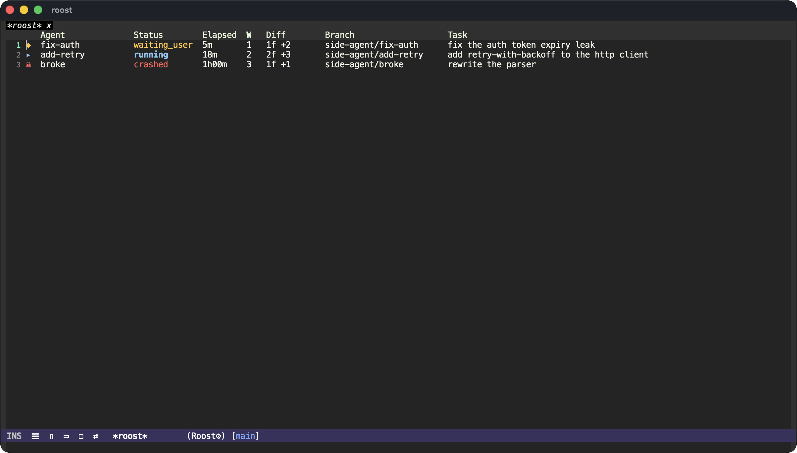

# roost

**The perch from which you watch and direct a flock of coding agents — in Emacs.**

Background agent frameworks that drive **tmux** run each agent in its own tmux
window and git worktree, and record their lifecycle in a small registry.
[`tmux-control`](https://github.com/csheaff/tmux-control) already renders those
tmux windows as live Emacs buffers. Roost is the thin layer that turns *watching*
into *acting*: it reads the registry and, leaning entirely on tmux-control to do
the rendering, lets you jump to the agent that wants you, review its branch, and
see who-is-doing-what at a glance.



*`roost-status` — every agent at a glance: status (color-coded), how long it has
run, its diffstat, branch, and task. `RET` jumps to it, `r` reviews it, `m`
merges & retires it, `e` re-steers it.*

## What it does

- **`roost-status`** — a dashboard of every agent: status, elapsed, idle,
  diffstat, branch, task (idle flags an agent that has gone quiet). From it: `RET` jump · `r` review · `m` merge & retire · `e`
  send/steer · `k` kill · `d` dispatch · `g` refresh.
- **`roost-next-waiting`** — jump the live view to the next agent that wants your
  attention (finished its turn, failed, or crashed), cycling in tab order.
- **`roost-review`** — open **magit** on the agent's git worktree, so you review
  and merge its branch with your normal tools, in the same Emacs as its live TUI.
- **`roost-merge-retire`** — merge the agent's branch into the base and tear it
  down (worktree, branch, window). Guarded: a conflict aborts and sends you to
  magit instead of leaving a half-merged tree.
- **`roost-send`** — re-steer an agent by sending it a prompt, without leaving
  Emacs.
- **`roost-dispatch`** — kick off a new agent (sends `/agent <task>` to the
  orchestrator pane).
- **`roost-watch-mode`** — a global mode that reflects each agent's status into
  its tmux window name (a leading glyph) so tmux-control's **tab bar and flock
  view light up** (*no change to tmux-control*), **notifies** you when an agent
  starts waiting, and keeps the dashboard live.


*The window tab bar, fed by `roost-watch-mode`: `◆ fix-auth` is waiting, `▸
add-retry` is running, `☠ broke` crashed — glyphs reflected into each agent's
tmux window name, which tmux-control simply renders.*

## The loop

1. Dispatch a few agents (`/agent <task>`, or `roost-dispatch`). Each gets its
   own tmux window, git worktree, and topic branch.
2. Work on your own thing; glance at the tab bar — `▸` running, `◆` waiting.
3. A `◆` appears → `roost-next-waiting` jumps you to it; read its reasoning.
4. `roost-review` → magit on its worktree → review the diff, merge the branch.
5. Repeat. You conduct; review never makes you leave the cockpit.


## Design

Roost builds **on top of** the framework and tmux-control rather than
reimplementing either:

- The **framework** owns spawning (window + worktree + branch) and writes the
  registry. The reference producer is
  [`pi-side-agents`](https://www.npmjs.com/package/pi-side-agents); the contract
  is `<repo>/.pi/side-agents/registry.json` (per-agent `status`, `task`,
  `worktreePath`, `branch`, `tmuxWindowIndex`). Point roost at another producer
  with `roost-registry-relative-path`.
- **tmux-control** owns rendering. Roost touches it through just two seams — the
  tmux **window** (switch by index) and its **name** (the status glyph) — so
  tmux-control stays completely agent-agnostic.

## Install

```elisp
(use-package roost
  :straight (roost :type git :host github :repo "csheaff/roost")
  :after tmux-control
  :custom
  ;; The repository whose agents you watch (resolved to its git root).
  (roost-directory "~/code/your-project"))
```

`magit` is an optional, soft dependency (`roost-review` falls back to `dired`).

## Status

Experimental (v0.2). Validated against a `pi-side-agents` fleet rendered
through tmux-control — including a real qwen agent — across the dashboard,
status glyphs in the tab bar, notify-on-waiting, jump-to-waiting, magit review,
merge-and-retire, and re-steering an agent. Single-host / single agents-session
for now; remote worktrees would need TRAMP.

## License

GPL-3.0-or-later.
