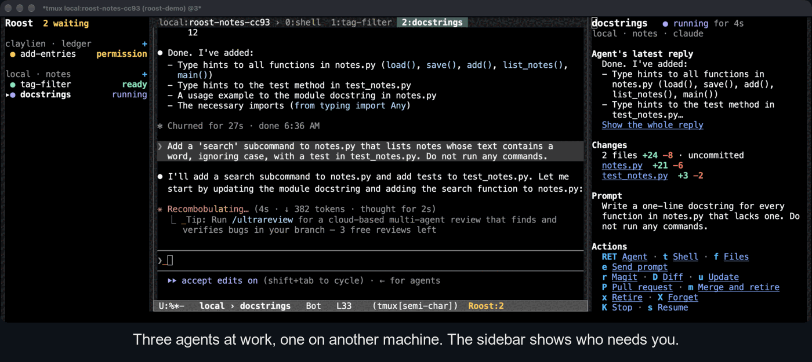
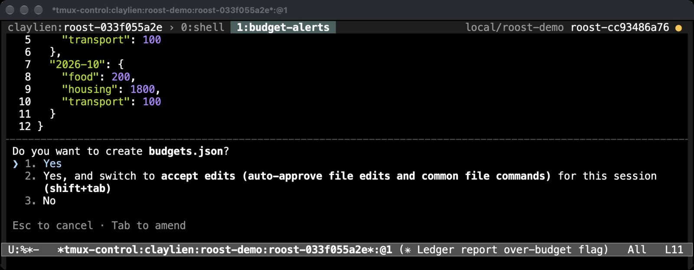
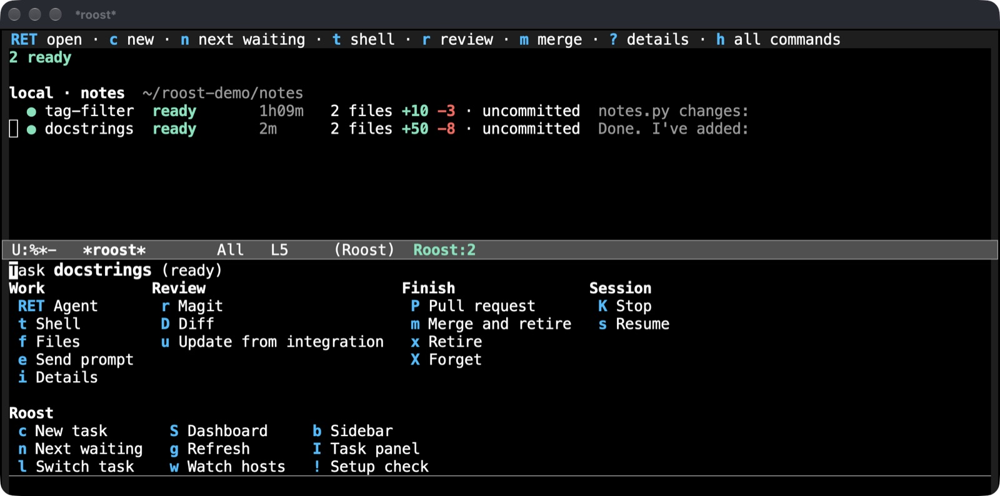

# Roost

[](https://github.com/csheaff/roost/actions/workflows/ci.yml)

Running more than one coding agent means juggling terminals, wondering which
one is waiting on you, and untangling their changes afterwards. Roost gives each
agent ([Claude Code](https://claude.com/claude-code),
[Codex](https://github.com/openai/codex) or [Pi](https://github.com/earendil-works/pi))
its own Git worktree, branch and persistent terminal, on your machine or any SSH
host. It tells you which agents need you, and you review and merge their work
with Magit. If you've used Orca or Conductor, it's that idea, inside the Emacs
you already use.

Roost is built and tested around Claude Code: it's the agent Roost is used with
day to day, and each Claude Code release is checked against what Roost reads
from it. Codex and Pi tasks work, with less: Codex asks before each commit and
reports nothing until its first turn, and Pi is experimental.



*Real Claude Code agents in a plain Emacs, one of them on another machine: it
asks permission, `n` takes you to it, you answer, look at its changes and merge.*

- **See who needs you.** The sidebar, the dashboard and your mode line show which
  agents are waiting, permission requests first, and `n` takes you to the next.
- **The agent's real terminal.** Permission prompts, diffs and slash commands work
  as in any terminal; [tmux-control](https://github.com/csheaff/tmux-control)
  renders each agent's own interface in an Emacs buffer.
- **Tasks stay apart.** Each has its own worktree and branch, so agents never
  trip over each other or over your checkout.
- **Agents outlive Emacs, on any machine.** They run in tmux, locally or on any SSH
  host with Python 3, Git and tmux. Close Emacs or lose Wi‑Fi, then pick up
  where they are.
- **Start from your notes.** An Org heading, a region of code or a GitHub issue
  becomes the prompt.
- **Finish with the tools you know.** Try the work in a shell beside the agent,
  review it in Magit, merge it or open a pull request. Roost never stages or
  commits your work, and deletes it only when you discard a task and type its
  name.

### Why not just run the agent in a terminal?

For one agent, do. With several, you need to know which one is waiting, keep
their changes apart, and finish each one cleanly. Roost puts every agent in its
own worktree, so they can't overwrite each other; watches the agents' own
lifecycle hooks, so it knows which are working, waiting or done, on every
machine; keeps them in tmux, so closing Emacs costs nothing; and makes finishing
a review in Magit followed by a merge or a pull request.

### Try it

1. [Install](#install) Roost and tmux-control.
2. `M-x roost-doctor` checks this machine, and any SSH hosts you list.
3. In a Git project, `M-x roost-new-task`, write a prompt, and `C-c C-c`.
4. `M-x roost-status` opens the dashboard; `b` there pins the task list to the
   side.

## A day with Roost

**Start a task.** `c` opens a draft. The project comes from where you are, or from
projects you've used. Click a field or use its key to change it, write the prompt
(it can span lines), and press `C-c C-c`. Roost creates the branch and worktree,
starts the agent in tmux, and opens its terminal.

**Start from where the work is.** Your task list can stay where it already is:

- Run `M-x roost-new-task` on an Org heading, or on its agenda line. The
  heading and its notes become the prompt, and the heading records the task (a
  `ROOST_TASK` property), so Roost commands run there, such as
  `roost-open-task` or `roost-review`, act on it.
- Select a region first, and the selection becomes the prompt. Code is quoted
  with its file and lines, ready for you to say what to do with it.
- Press `C-c C-t` in the draft to pick one of the project's open GitHub issues.
  Its title and text become the prompt, and the task's pull request will close
  it.


**Let them work.** Start more tasks; each is independent. Roost watches the
agents' own lifecycle hooks and notifies you when one finishes or asks for
permission, with the first line of its reply or what it asks (`Asks to run
make test`), so you can tell from the notification whether it needs you now.
The agent whose terminal you are looking at doesn't notify. The dashboard
shows the same for every agent, and the mode line counts the agents waiting
(`Roost:2`; click it for the next one). `n` jumps to the next agent waiting for you, permission requests
first. Answer it in the terminal, then `n` again. A finished agent you have
looked at stops counting, and turns grey, until it replies again.


*`M-x roost-status`, the dashboard. `RET` on a row opens that agent's own
terminal.*

**Keep them in view.** `b` in the dashboard, or `M-x roost-sidebar-mode`, keeps a
compact task list at the left of every frame, through perspective and tab
switches and `C-x 1`; add `(roost-sidebar-mode 1)` to your configuration to have
it from the start. An open task also gets a panel at the right of its
terminal: the agent's latest reply, the files it changed (each opens its diff)
and the actions, kept current as the agent works. The panel steps aside when
the terminal would drop below 80 columns; `q` in it turns it off, and `I` in the
dashboard or sidebar turns it back on.



*`RET` opens the agent's real terminal, here Claude Code on the SSH host
`claylien` asking before it creates a file. Answer it as you would anywhere.*

**Check the work yourself.** `t` opens a shell beside the agent, in the same
worktree. Run the tests, start the app, poke at it.


**Review in Magit.** `r` opens Magit on the task's worktree, through TRAMP for
remote tasks. Stage, edit and commit as usual.


**Catch up and finish.** When other tasks land first, the dashboard shows the
task falling behind (`↓2`). `u` merges the integration branch into the task's
own worktree. If that conflicts, Roost offers to have the task's agent resolve
it, run the tests and commit. Then `m` merges the task into the branch it
started from and removes its worktree, branch and window.

**Or open a pull request.** To finish on GitHub instead, `P` drafts one: the first
line is the title and the rest the body, prefilled from the agent's commit
message. `C-c C-c` pushes the branch and creates it (`C-u C-c C-c` as a draft).
The dashboard then shows `#12` with its checks and review. Send review feedback
to the agent with `e`; when it has committed, `P` pushes the new commits and
opens the pull request. Once it is merged, `x` retires the task and deletes the
branch. Needs `gh` on the task's host, and Git credentials there that can push.


*`i` shows a task's panel: what the agent said, what changed, and what you can
do next.*

## Install

Requirements: Emacs 29.1+ and [tmux-control](https://github.com/csheaff/tmux-control)
0.7.0+ (which brings [Eat](https://codeberg.org/akib/emacs-eat)). Each task host needs
Python 3.9+, Git, tmux 3.0+, and an installed, signed-in agent CLI (Codex 0.160.0
or newer). Remote hosts need key- or agent-based SSH; use SSH config aliases for
ports and jump hosts. Roost copies its helper to each host itself.

Emacs 30 (built-in `use-package`):

```elisp
(use-package tmux-control
  :vc (:url "https://github.com/csheaff/tmux-control" :rev :newest))

(use-package roost
  :vc (:url "https://github.com/csheaff/roost" :rev :newest)
  :custom (roost-hosts '(nil "devbox")))   ; nil is this machine
```

Emacs 29: `M-x package-vc-install` tmux-control's URL, then Roost's, and
`(setq roost-hosts '(nil "devbox"))`.

straight.el:

```elisp
(use-package tmux-control
  :straight (:host github :repo "csheaff/tmux-control"))
(use-package roost
  :straight (:host github :repo "csheaff/roost" :files ("roost.el" "scripts"))
  :custom (roost-hosts '(nil "devbox")))
```

Doom Emacs, in `packages.el`:

```elisp
(package! tmux-control :recipe (:host github :repo "csheaff/tmux-control"))
(package! roost :recipe (:host github :repo "csheaff/roost" :files ("roost.el" "scripts")))
```

and in `config.el`: `(setq roost-hosts '(nil "devbox"))`.

Then run **`M-x roost-doctor`**. It checks Emacs's side and, on each host, SSH,
Python, Git, tmux and each agent CLI's version and sign-in, with a fix for
anything missing. For pull requests it also checks the GitHub CLI and whether
Git on the host can push each project you've used there (a dry run that sends
nothing). `C-u M-x roost-doctor` checks a host before you add it.

Magit is optional (review falls back to Dired).

### Fitting your setup

- **Workspaces.** Each task gets its own window arrangement: a perspective with
  [perspective.el](https://github.com/nex3/perspective-el), otherwise a tab when
  `tab-bar-mode` is on, otherwise none (tasks open in the selected window). Set
  `roost-workspace` to choose.
- **Evil.** Roost's dashboard and panels start in Emacs state so their keys work
  (`roost-evil-state`); `j`/`k` move between tasks. Drafts start in insert
  state. tmux-control starts agent terminals in insert state, so typing reaches
  the agent; ESC returns to normal state.
- **Other modal setups** (Meow, xah-fly-keys): put `roost-dashboard-mode`,
  `roost-task-info-mode` and `roost-doctor-mode`, and the drafts
  `roost-compose-mode`, `roost-send-mode` and `roost-pr-mode`, in your insert or
  Emacs-state list so their keys work.
- **Completion.** Prompts use `completing-read`, so Vertico, Ivy, Helm and the
  default UI all work.

## Commands

`roost-status` opens the dashboard. In it, and in a task's details panel:



| Key | Command | |
| --- | --- | --- |
| `h`, `?` | `roost-dispatch` | A Magit-style menu of every command below, naming the task they act on |
| `RET` | `roost-open-task` | Open the task's agent terminal and workspace; for a stopped or crashed agent, offer to resume it |
| `c` | `roost-new-task` | Draft a new task, from the region or Org entry if any (`C-u` forks the current task's commits) |
| `n` | `roost-next-waiting` | Next task waiting for you, permission requests first |
| `t` | `roost-shell` | Shell beside the agent, in the worktree (reused) |
| `f` | `roost-files` | Dired in the worktree |
| `r` | `roost-review` | Magit in the worktree |
| `D` | `roost-diff` | Diff the task's own changes, including uncommitted ones |
| `e` | `roost-send` | Paste a prompt into the agent and press Enter |
| `i` | `roost-task-info` | Prompt, changes, actions and details |
| `l` | `roost-switch-task` | Choose a task by name, waiting tasks first |
| `b` | `roost-sidebar-mode` | Keep the task list at the left of every frame |
| `I` | `roost-task-panel-mode` | Dock the open task's panel beside its terminal |
| `u` | `roost-update` | Merge the integration branch into the task |
| `P` | `roost-pr` | Draft a pull request for the task; if it has one, push new commits and open it (`C-u`: open only) |
| `m` | `roost-merge-retire` | Merge committed work, then retire the task |
| `x` | `roost-retire` | Retire a task that is already merged or has no commits |
| `X` | `roost-forget` | Drop the task from Roost, keeping its worktree and branch, or discarding them (`roost-discard`): Roost first says what would be lost, and to lose commits or files you type the task's name |
| `K` | `roost-stop` | Stop the agent's window; keep all work |
| `s` | `roost-resume` | Restart a stopped task in its recorded conversation |
| `g` | `roost-refresh` | Refresh status and Git statistics |

`j`/`k` or `TAB` move between tasks; `mouse-1` opens one and `mouse-3` shows its actions.
Outside the dashboard, commands act on the task of the current terminal,
worktree file, Org entry or perspective, or ask. Bind the menu globally to reach
Roost from anywhere, for example `(keymap-global-set "C-c r" #'roost-dispatch)`.
Also available: `roost-send-region` (sends the selection with its file and
lines). Roost watches its hosts once you open the dashboard or sidebar or start
a task: every 3 seconds while Emacs is in front, every 15 otherwise.
`roost-watch-mode` turns that off and on.

In the new task draft: `C-c C-c` creates, `C-c C-k` cancels, and `C-c C-p`,
`C-c C-a`, `C-c C-b` and `C-c C-n` change the project, agent, starting ref and
name. `C-c C-t` starts from a GitHub issue (with `gh` on the project's host). An
empty name is derived from the prompt.

In the pull request draft: `C-c C-c` creates the pull request (`C-u` as a draft)
and `C-c C-k` cancels. A failed creation keeps the draft.

## Configuration

- `roost-hosts`: hosts the dashboard watches (`nil` is local). Hosts and projects
  you create tasks in are remembered in `roost-hosts-file` and `roost-projects-file`;
  `M-x roost-forget-host` stops watching one you no longer use.
- `roost-default-agent`, `roost-agent-commands`: which agent new tasks use, and
  each CLI with extra arguments, such as `("claude" "claude" "--model" "sonnet")`.
  Roost owns worktree, resume and hook flags and rejects conflicting ones.
- `roost-setup-command`: a shell command run once in a new worktree before the
  agent starts, such as `npm ci`. Set it in `.dir-locals.el` per project:
  `((nil . ((roost-setup-command . "npm ci"))))`. Emacs reads a remote
  project's `.dir-locals.el` only with `enable-remote-dir-locals` on. A new
  worktree lacks files Git doesn't track, such as `.env`; the command finds the
  primary checkout in `$ROOST_REPO`: `cp "$ROOST_REPO/.env" . && npm ci`.
- `roost-branch-prefix`: topic branches are `PREFIX<name>-<id>`; default `roost/`.
- `roost-state-directory`: where each host keeps task records, the helper and
  worktrees; default `~/.local/share/roost`.
- `roost-socket-name`: the tmux socket (default tmux-control's). Each task has a
  session of its own, named after its project and task.
- `roost-sidebar-width` (30), `roost-task-panel-width` (44): the sidebar and
  the panel docked beside a task's terminal.
- `roost-workspace`, `roost-compact-mode-line`: how tasks get their own windows
  (see above); with perspective.el, task perspectives share one
  `Roost: host/task +N` entry in the perspective bar.
- `roost-mode-line-count`: the waiting count in `global-mode-string`. For a
  mode line of your own, set it to nil and place
  `(:eval (and (fboundp 'roost-mode-line-waiting) (roost-mode-line-waiting)))`
  where you want the count.
- `roost-notify`, `roost-notify-function`: notifications use
  [terminal-notifier](https://github.com/julienXX/terminal-notifier) when it is
  installed (`brew install terminal-notifier`), otherwise macOS's own or Emacs's
  `notifications-notify`. With terminal-notifier and an Emacs server
  (`server-start`), clicking one opens its task, and a newer one about the same
  task replaces it.
- `roost-watch-interval` (3 s), `roost-watch-unfocused-interval` (15 s),
  `roost-request-timeout` (60 s), `roost-ssh-share-connections`.

Each poll is one SSH command per host. Roost shares one connection per host
across them (OpenSSH `ControlMaster`, with its socket in the state directory and
closed a minute after the last request), so polls skip the handshake; set
`roost-ssh-share-connections` to nil to leave that to your ssh configuration.
Unreachable hosts are retried with backoff and keep their last known tasks,
marked unreachable.

## How it works

Emacs talks to a small standard-library Python helper on each host, over SSH
with JSON on stdin and stdout. All requests are asynchronous; the dashboard
draws from a local cache. The helper creates worktrees, starts each agent under
a runner in its own tmux window, and records the task.

Status comes from each agent's native lifecycle events: Claude Code hooks passed
with `--settings`, Codex hooks passed per invocation, and a Pi extension. Roost
never changes your global agent settings or answers prompts.

| Status | Meaning |
| --- | --- |
| `running` | The agent is working on a prompt |
| `permission` | The agent asked for permission; answer it in the terminal |
| `ready` | The agent is waiting for your next prompt. Not "reviewed" or "done" |
| `background` | Claude background work or Pi queued messages remain |
| `starting` | Startup prompts may be showing; Codex reports status from its first turn |
| `exited`, `failed` | The agent exited normally, or the CLI failed; `RET` shows its last output. A Claude Code turn ended by an API error, such as a usage limit, is also `failed`, with the agent waiting |
| `crashed` | The agent's tmux pane disappeared |
| `stopped` | Stopped with `K`; `s` resumes the conversation |

A task's identity is its host and ID. A per-pane ownership tag keeps Roost from
steering or killing an unrelated pane after a tmux restart, and hooks from an
earlier run cannot overwrite a resumed one. Merging needs the task's worktree
clean. With the primary checkout on the task's integration branch, the merge
happens there and needs nothing uncommitted (untracked files stay); with it on
another branch, Git merges into the integration branch without touching your
checkout (Git 2.38 or newer). A conflicting merge leaves nothing changed. Branches are deleted only if they still point at the
commit Roost verified. Git will not remove a worktree with submodules checked
out, since they may hold the only copy of commits made in them, so Roost
refuses to retire one; once those commits are safe, remove it with
`git worktree remove --force` and retire again.

Things to know:

- Agents report nothing when you answer a permission request, so Roost looks
  for itself. A Claude Code command you approve shows `running` at the next
  poll, once Roost sees it start; declined, or stopped with Esc, the task
  shows `ready`, read from its transcript. Claude Code's other tools, and
  Codex and Pi tasks, may keep showing `permission` until the agent moves on.
  `e` asks before sending to a task in that state.
- Roost's task sessions stay out of the corner where tmux-control names other
  sessions with new output, and its terminals don't show that corner: it
  lights up whenever an agent prints anything, and only shows its terminal.
  Roost tells you when an agent needs you, and `n` or a click on `Roost:N`
  switches to the task.
- Claude Code now starts in auto mode for some accounts, approving most
  commands itself, so its tasks rarely ask. To be asked before each command,
  add `"--permission-mode" "manual"` to Claude's entry in `roost-agent-commands`.
- Roost turns on tmux's `extended-keys` on the server it starts agents on, so
  they can tell Shift+Return and Option+Return from Return (a new line in
  Claude's prompt rather than sending it). Programs that do not ask for
  extended keys see no difference. Agents started before it was on need `s`.
- Claude Code can make worktrees of its own (`EnterWorktree`, isolated
  subagents, `/batch`), in the primary checkout's `.claude/worktrees`. In a
  task they start from the task's work, its panel lists them with what they
  hold, each opening in Magit, and the task can't be merged or retired while
  one holds work not on the task's branch.
- Claude and Codex each ask once per repository to trust it; every task worktree
  of that repository is trusted after that.
- Codex asks you to review Roost's observer hooks the first time. The hook
  command stays the same across Roost upgrades. Codex's sandbox keeps a
  worktree's shared `.git` read-only, so it asks before committing.
- Pi is experimental: launch, events and resume were checked, but no full model run.
- A GitHub issue's text goes to the agent as written, and anyone can open an
  issue on a public repository. Read it in the draft before pressing `C-c C-c`.

## Upgrading

Since 0.8.1 (unreleased):

- The sidebar (`b`) and the task panel beside each terminal. The panel lists
  only what a task can do now and says what comes next; the command menu
  greys out the rest.
- Each task has a tmux session of its own, which ends with the task. Older
  tasks move to their own when resumed. `roost-session-name` is gone.
- `X` keeps or discards a task's worktree and branch (`roost-discard`), and
  `m` merges while your checkout is on another branch (Git 2.38+).
- Failed, crashed and exited agents count as waiting until you've seen them,
  and what you've seen is kept on the task's host, for your other machines and
  the next session.
- Keys follow Magit's: `h` and `?` open the menu, `i` a task's details (`?`
  before); `l` switches task. Roost polls every 15 s while Emacs isn't in
  front (`roost-watch-unfocused-interval`).
- `M-x roost-forget-host`; setup commands get the primary checkout in
  `$ROOST_REPO`; a notification click opens its task (terminal-notifier).
- Claude Code worktrees an agent makes for itself show in its task's panel.
- With tmux-control newer than 0.7.2, switching sessions from a terminal
  (`C-c C-s`, next and previous session) opens that task in its workspace.
- `roost-claude-command` moved into `roost-agent-commands`, and
  `roost-use-perspectives` into `roost-workspace`; both still work.
- An agent keeps the hooks it was started with, so one started before this
  notices its own worktrees only after `K` and `s`.

0.8 adds GitHub issues as a starting point (`C-c C-t` in the draft), the
command menu (`h`, or `roost-dispatch` from anywhere), the mode-line count of
waiting agents, links between Org entries and their tasks, and one shared SSH
connection per host. It needs transient, which Emacs 29 includes.
`roost-dispatch` used to be an alias for `roost-new-task`; it now opens the
menu, where `c` starts a task.

0.7 needs tmux-control 0.7.0, which adds the public API Roost now uses. Update
tmux-control first: with straight.el or a Git checkout, pull it before Roost;
with `package-vc`, run `package-vc-upgrade` on tmux-control, then Roost. Then
restart Emacs. `M-x roost-doctor` flags an older tmux-control. 0.7 also adds
pull requests (`P`), the agent's latest reply in the dashboard, task panel
and notifications, prompts from Org entries and the region, and a push check
in `roost-doctor`. `D` now diffs a task's own changes since it last met its
integration branch, so updates from `u` no longer appear as the task's work.

0.6 declares tmux-control as a package dependency and adds `roost-doctor`,
tab-bar workspaces and Evil support. Stopping a task moved from `k` to `K`; `j`
and `k` now move between tasks in the dashboard.

0.5 defaults new branches to `roost/…` (formerly `codex/roost/…`; existing tasks
keep theirs). It replaces the minibuffer prompts of `roost-new-task` with the
draft buffer; called from Lisp with arguments, it still creates the task
directly. Retired task records are now deleted. Codex tasks started after
upgrading ask for one final hook review.

0.4 added Codex and Pi. 0.3 replaced the 0.2 Pi orchestrator registry.

## Development

`make test compile` runs the ERT suite, the Python lifecycle tests against real
Git and isolated tmux sockets (fixture agents drive the actual hook commands,
without model calls), and a warning-free byte-compile. CI runs it on Emacs 29.1
and 30.1.

Claude Code updates itself often, and Roost relies on what it reports and
does. `make contract` scans the installed Claude Code for the hook events,
notification types and payload fields Roost reads, and names any it has not
seen; `make contract-live` also takes a real session (a few short Haiku turns,
about three minutes) through each status Roost derives: a reply, a permission
request approved and declined, Esc, a minute idle and `/clear`. Run them after
Claude Code updates.

See [validation](docs/validation.md) for the live runs with Claude Code and Codex on
local and remote hosts, [the demo notes](docs/demo.md) for how the screenshots
were made, and [MELPA](docs/melpa.md) for the package recipes.

[Orca](https://www.onorca.dev/) shaped the workflow: a worktree per task, a
terminal nearby, review before finishing. See the
[comparison](docs/orca-comparison.md).

## License

GPL-3.0-or-later.
