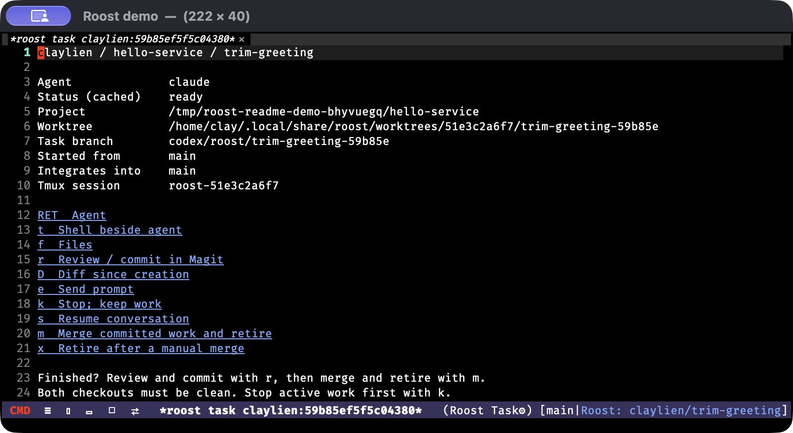

# Roost

Coding agent tasks in Emacs, locally or over SSH. Claude Code, Codex CLI and
Pi keep their own terminal interfaces. Roost joins Git worktrees, persistent tmux windows,
[tmux-control](https://github.com/csheaff/tmux-control), TRAMP, Magit, and
[perspective.el](https://github.com/nex3/perspective-el) into one task workflow.

## A task in Emacs

The agent and a reusable shell share the task's worktree. Run your own tests beside
the agent, then review and commit with Magit.


`roost-review` opens Magit in that worktree. Expand the actual Git diff to review
the implementation and tests before committing.


`roost-task-info` keeps the project, starting branch, integration target, and
review/finish actions together.



These captures show a disposable `hello-service` project running on an SSH host
in GUI Emacs. See [the demo walkthrough](docs/demo.md) for the commands and
capture details. The font, theme and keybindings come from the user's Emacs
configuration; Roost supplies the task workflow.

## The workflow

1. Run `M-x roost-new-task` from a project or choose its directory. A TRAMP path
   such as `/rpc:claylien:/home/clay/code/project/` creates the task on that host.
2. Give it a name, choose Claude, Codex or Pi, select a starting Git ref (leave empty for the primary checkout's
   current branch), and optional initial prompt. New tasks are independent even
   when created from another task's worktree. A prefix argument defaults to
   forking the current task's committed `HEAD` instead.
   Roost creates a topic branch, worktree, and tmux window, then opens the actual
   agent terminal. Answer startup and permission prompts there as usual.
3. Open `roost-status` to see tasks across hosts. `RET` restores a task's terminal
   and perspective; arrange code and review buffers alongside it as you prefer.
   `roost-next-waiting` cycles through sessions ready for input or permission.
4. Use `roost-review` for Magit in the worktree, or `roost-diff` for tracked changes
   against the starting commit. Remote files use your configured TRAMP method.
   `project.el` and Projectile can use the worktree's normal project directory.
   `roost-shell` opens a reusable shell beside the agent, in the same worktree;
   `roost-files` browses it. `roost-task-info` shows the project, starting branch,
   integration target, and review/finish actions.
5. Review and commit in Magit, then `roost-merge-retire` to merge into the recorded
   integration branch in the primary checkout and remove the task's resources.
   Or merge manually and run `roost-retire`.

Closing Emacs or losing SSH leaves the agent running in tmux. Reopen Roost and
select the task to reconnect. `roost-stop` stops its window and processes while
keeping the worktree, branch, and conversation. `roost-resume` starts a new
window with the recorded conversation: a session ID for Claude/Codex, or a
session file for Pi. If startup never recorded a conversation, resume starts
a new one instead.

## Install

Requirements: Emacs 29.1+, tmux-control, and, on each task host, Python 3.9+, Git,
tmux, and an installed, authenticated CLI for the selected agent. Python uses only its
standard library. Use Codex CLI 0.160.0 or newer for its lifecycle hooks;
Pi was checked with 0.78.1. Remote hosts need key/agent-based SSH authentication; use SSH
config aliases for ports, ProxyJump, or other connection settings.

Keep `scripts/roost_remote.py` beside `roost.el`; Roost installs a versioned copy
on each host automatically. Existing tasks keep their original helper until
resumed, so upgrading Roost does not change a running agent process.

```elisp
(use-package roost
  :ensure nil
  :load-path "~/code/roost"
  :commands (roost-status roost-new-task roost-switch-task)
  :custom
  (roost-hosts '("claylien" nil))) ; nil = local
```

For Straight, include the helper directory in the package recipe:

```elisp
:straight (roost :type git :host github :repo "csheaff/roost"
                 :files ("roost.el" "scripts"))
```

Magit is optional (`roost-review` falls back to Dired). If perspective.el is
active, each task gets a separate saved window arrangement. Without it, task
switching still opens the correct terminal. Other perspective packages do not
provide the same API; they are not integrated.

## Commands

| Dashboard key | Command | Action |
| --- | --- | --- |
| `RET` | `roost-open-task` | Open selected task |
| `c` / `d` | `roost-new-task` | Create a worktree and agent window |
| | `roost-switch-task` | Choose a task across hosts |
| `n` | `roost-next-waiting` | Cycle through ready/permission sessions |
| `r` | `roost-review` | Magit status in the task's worktree |
| `t` | `roost-shell` | Reuse a worktree shell beside the agent |
| `f` | `roost-files` | Browse the worktree with Dired |
| `?` / `i` | `roost-task-info` | Task details and review/finish actions |
| `D` | `roost-diff` | Tracked changes since task creation |
| `e` | `roost-send` | Paste a prompt literally, then Enter |
| | `roost-send-region` | Send selected text with file/line context |
| `s` | `roost-resume` | Restart a stopped/exited task |
| `k` | `roost-stop` | Stop the window; retain all work |
| `x` | `roost-retire` | Remove a clean task already merged into its integration branch |
| `m` | `roost-merge-retire` | Merge committed work, then retire |
| `g` | `roost-refresh` | Refresh status and Git statistics |
| | `roost-watch-mode` | Toggle periodic background status refresh |

The dashboard's `Since` column measures time since the last status event.
`Changes` is Git's tracked diffstat against the recorded starting commit; inspect
Magit to see untracked files as well. Background polls skip Git; press `g` for
fresh statistics. An offline host retains its last known tasks and reports
`offline`, rather than declaring the agent crashed.

## Configuration

- `roost-hosts`: hosts monitored by the dashboard. Hosts used to create tasks are
  also remembered locally in `roost-hosts-file` across Emacs restarts.
- `roost-state-directory`: `~/.local/share/roost` on each host, containing private
  task records, per-task hook settings, versioned helpers, and worktrees.
- `roost-socket-name`: defaults to tmux-control's socket, normally `main`.
  Remote operations also use `tmux-control-remote-tmux-socket-setup` and
  `tmux-control-ssh-options`, so the terminal and task manager see the same server.
- `roost-session-name`: nil creates one tmux session per repository, with a general
  shell window and one window per task. Set a name to use an existing session
  instead; a missing session is created. Renaming sessions or renumbering windows
  does not change task identity.
- `roost-claude-command`: executable plus extra arguments, e.g.
  `'("claude" "--model" "sonnet")`. Common CLI installation directories are added
  to the runner's PATH. Roost owns worktree, resume, and hook flags; conflicting
  CLI options are rejected. Claude's normal settings and approval mode still apply.
- `roost-setup-command`: optional shell command run once in a new worktree before
  the agent. It can be directory-local, e.g. `npm ci`; it does not rerun on resume.
- `roost-use-perspectives`, `roost-notify`, `roost-watch-interval` (3 seconds), and
  `roost-request-timeout` (60 seconds) customize the Emacs integration.

For a project setup command:

```elisp
;; .dir-locals.el
((nil . ((roost-setup-command . "npm ci"))))
```

When creating from an existing task worktree, an empty starting ref uses the
primary checkout's current branch. Explicit `HEAD` uses the source worktree's
current committed state. A prefix argument defaults the source directory to the
current task's worktree and the starting ref to `HEAD`. Dirty files are never
copied. The new task belongs to the original repository and integrates into its
primary checkout.

Task commands infer context from the selected dashboard row, tmux pane, worktree
directory, or current perspective. Switching perspectives manually follows the
task too. An unrelated perspective does not silently target the last task.
Task panels retain their own identity even when opened in another workspace.

The perspective bar groups task workspaces into one clickable label, such as
`Roost: claylien/trim-greeting +39`, rather than listing every task. Click it or
use `roost-switch-task` for the searchable task picker; use `roost-status` for
the dashboard. Ordinary perspectives retain their labels. Long task names are
shortened in the bar, with the full name in its tooltip and picker. Set
`roost-compact-mode-line` to nil to use Perspective's original display.

Setup is an ordinary project shell command. Review it when Emacs asks about
local variables, and keep Gitignored dependencies out of commits.

## Lifecycle and review

Roost observes each agent's native lifecycle events:

| Agent | Status and resume integration | Native validation |
| --- | --- | --- |
| Claude Code | Per-task `--settings` hooks; conversation ID | Full edit, approval, review, resume and merge workflow |
| Codex CLI | Per-invocation hooks; conversation ID | Codex 0.160.0; see [validation notes](docs/validation.md) |
| Pi (experimental) | Per-invocation extension; exact session file | Pi 0.78.1; launch/events checked, model authentication required for a full run |

[Codex hooks](https://learn.chatgpt.com/docs/hooks) require its normal trust
review. Review Roost's observer command in the terminal or `/hooks` and trust
it to enable status tracking. A helper upgrade changes that command and needs
review again. Codex 0.160.0 emits its start event on the first submitted turn,
including after resume. Until then Roost shows `starting`: enter the first prompt
in Codex's terminal (or supply one during task creation). After that, normal
status tracking and `roost-send` are available. Task details include this hint.
Older CLIs without these lifecycle hooks are not supported.
Roost does not edit global agent settings or approve tool calls.

Pi's observer and conversations live in Roost's state directory, outside the
worktree. Existing Pi extensions remain active. Configure and authenticate the
model in Pi normally; Roost does not borrow Claude's credentials. Pi exposes
turn start/end events but has no universal permission event for third-party
approval extensions: answer those prompts directly in its terminal.

`running` means the agent submitted a prompt or is using tools. `ready` means it
started or finished a response; it does **not** mean the task is reviewed or
complete. `permission` needs a terminal answer; `roost-send` refuses to paste
into startup and detected permission prompts. Claude background work and Pi
queued messages report `background`. `failed`, `exited`, and `crashed`
distinguish CLI failure, normal exit, and a missing/dead tmux pane. Disabled or
untrusted hooks, and CLI failures that omit turn-end events, can leave finer
status information stale; the native terminal remains the source of truth.

Task identity is `(SSH host, task ID)`. Window/pane IDs and a pane ownership tag
prevent window renumbering or a restarted server from steering unrelated panes.
Old hooks cannot overwrite a newer resumed run. SSH requests and polling are
asynchronous; rendering the dashboard reads a local cache.

Retirement requires both checkouts to be clean, including untracked files, and
the primary checkout to remain on its recorded integration branch. Roost never
stages, commits, or force-removes work. Unmerged commits block retirement.
Merge conflicts abort the merge that Roost started and retain the task. A
persisted cleanup checkpoint permits retry after interrupted retirement.
The general shell/session remains available after the last task is retired.
The supporting task shell belongs to the task window: stopping or retiring the
task stops that shell too. Opening it again reuses its existing pane, preserving
shell history and running commands. A stopped task must be resumed first.

## Agent boundary

The host helper's `ClaudeAgent`, `CodexAgent`, and `PiAgent` adapters own command
validation, launch/resume arguments, and conversion of native events into Roost
statuses. Git worktrees, tmux ownership, SSH, review and retirement stay outside
the adapters. A future provider needs those operations plus CLI integration
validation. Changing a command executable alone does not provide integration.
Older records without an agent field or generic conversation ID still resume
through their recorded Claude conversation.

## Inspiration

[Orca](https://www.onorca.dev/) helped shape the workspace workflow: give each
task its own worktree, keep a terminal nearby, and review the result before
finishing. Those are general Git and terminal practices. Roost brings them
together using existing Emacs tools and the agent's own CLI.
See the [hands-on comparison](docs/orca-comparison.md) for the workflow details
that informed this version.

## Migration from 0.2

0.3 owns Claude task creation and its registry. It no longer reads
`.pi/side-agents/registry.json` or dispatches `/agent` to a Pi orchestrator.
Existing Pi tasks are untouched and are not imported. The old registry,
agent-session, and status-glyph customization variables no longer apply.
`roost-list` aliases `roost-switch-task`; `roost-kill` aliases `roost-stop`;
`roost-dispatch` aliases `roost-new-task` with its new arguments and prompts.

0.4 adds independent Codex and Pi tasks to that lifecycle. Existing 0.3 Claude
tasks and `roost-claude-command` continue working; Claude remains the default.

## Validation

Run `make test compile`. Tests use isolated tmux sockets and temporary Git
repositories; agent fixtures exercise real observer commands without API
calls. See [validation notes](docs/validation.md) for the checked remote and
native Emacs workflow. This remains experimental software.

## License

GPL-3.0-or-later.
