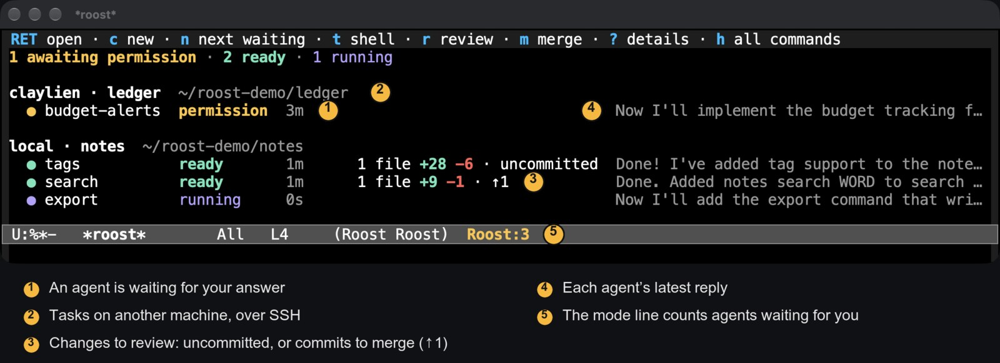
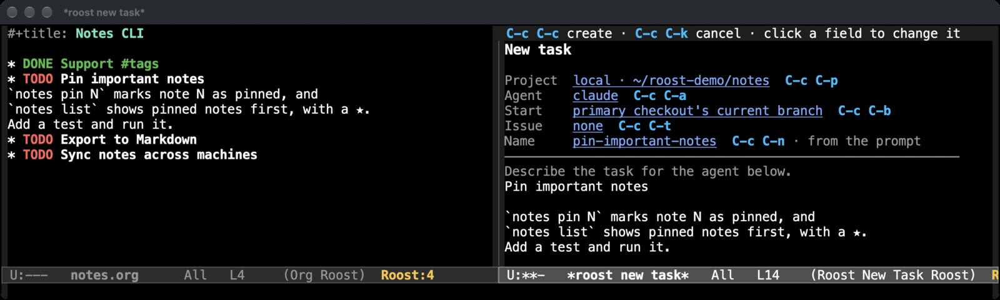
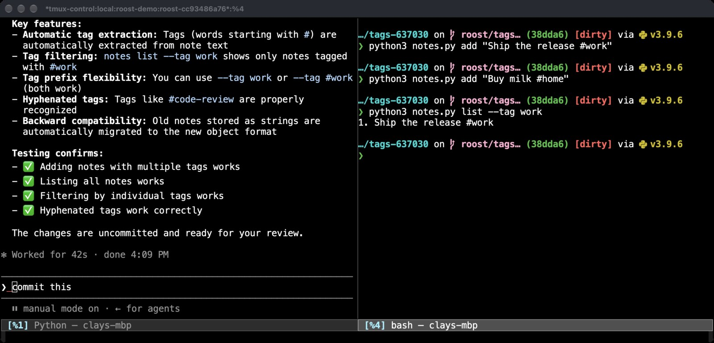
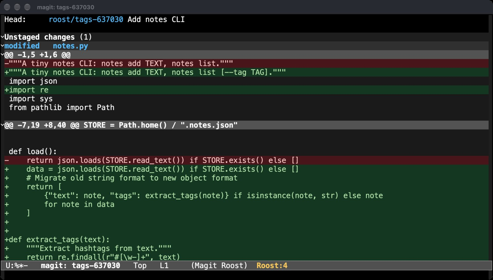
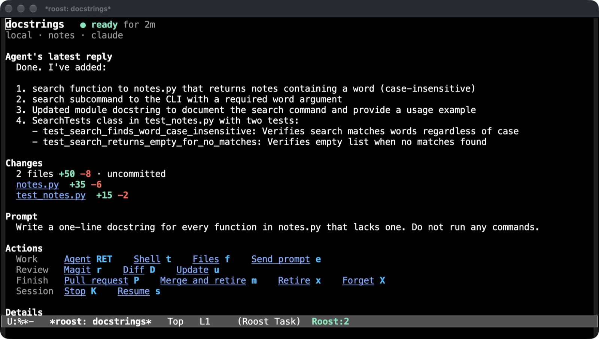

# Roost

Run a fleet of coding agents from Emacs, on your machine or on remote hosts
over SSH. Each task gets its own Git worktree, topic branch and persistent tmux
terminal running the agent's real CLI: [Claude Code](https://claude.com/claude-code),
[Codex](https://github.com/openai/codex) or [Pi](https://github.com/earendil-works/pi).
Roost tells you which agents need you, and gets the work reviewed and merged
with the Emacs tools you already use.



*Four tasks in two projects on two hosts. Below the dashboard is the selected
task's actual Claude Code terminal, waiting for an answer.*

- **Agents outlive Emacs.** They run in tmux on the task's host. Close Emacs, lose
  Wi‑Fi or sleep the laptop; reopen Roost and pick up where they are.
- **Native terminals, not a wrapper.** [tmux-control](https://github.com/csheaff/tmux-control)
  renders each agent's own interface, so permission prompts, diffs and slash
  commands work exactly as in a terminal.
- **One view across hosts.** Tasks are grouped by project, with what needs you
  first, Git changes, and commits ahead of or behind the branch you merge into.
- **Emacs does the rest.** Magit and Dired over TRAMP, a shell beside each agent,
  a perspective per task.
- **Finishing never loses work.** Merging refuses uncommitted files and keeps the
  task on conflicts. Roost never force-removes, stages or commits for you.

## A day with Roost

**Start a task.** `c` opens a draft. The project comes from where you are, or from
projects you've used. Click a field or use its key to change it, write the prompt
(it can span lines), and press `C-c C-c`. Roost creates the branch and worktree,
starts the agent in tmux, and opens its terminal.



**Let them work.** Start more tasks; each is independent. Roost watches the
agents' own lifecycle hooks and notifies you when one finishes or asks for
permission. `n` jumps to the next agent waiting for you, permission requests
first. Answer it in the terminal, then `n` again.

**Check the work yourself.** `t` opens a shell beside the agent, in the same
worktree. Run the tests, start the app, poke at it.



**Review in Magit.** `r` opens Magit on the task's worktree, through TRAMP for
remote tasks. Stage, edit and commit as usual.



**Catch up and finish.** When other tasks land first, the dashboard shows the
task falling behind (`↓2`). `u` merges the integration branch into the task's
own worktree. If that conflicts, Roost offers to have the task's agent resolve
it, run the tests and commit. Then `m` merges the task into the branch it
started from and removes its worktree, branch and window.

**Or open a pull request.** To finish on GitHub instead, `P` drafts one: the first
line is the title and the rest the body, prefilled from the task's commits and
prompt. `C-c C-c` pushes the branch and creates it (`C-u C-c C-c` as a draft).
The dashboard then shows `#12` with its checks and review, and `P` opens it in the
browser. Once it is merged, `x` retires the task. Needs `gh` on the task's host.



## Install

Requirements: Emacs 29.1+ and [tmux-control](https://github.com/csheaff/tmux-control)
(which brings [Eat](https://codeberg.org/akib/emacs-eat)). Each task host needs
Python 3.9+, Git, tmux 3.0+, and an installed, signed-in agent CLI (Codex 0.160.0
or newer). Remote hosts need key- or agent-based SSH; use SSH config aliases for
ports and jump hosts. Roost copies its helper to each host itself.

Emacs 30 (built-in `use-package`):

```elisp
(use-package tmux-control
  :vc (:url "https://github.com/csheaff/tmux-control" :rev :newest))

(use-package roost
  :vc (:url "https://github.com/csheaff/roost" :rev :newest)
  :custom (roost-hosts '(nil "devbox")))   ; nil is this machine
```

Emacs 29: `M-x package-vc-install` tmux-control's URL, then Roost's, and
`(setq roost-hosts '(nil "devbox"))`.

straight.el:

```elisp
(use-package tmux-control
  :straight (:host github :repo "csheaff/tmux-control"))
(use-package roost
  :straight (:host github :repo "csheaff/roost" :files ("roost.el" "scripts"))
  :custom (roost-hosts '(nil "devbox")))
```

Doom Emacs, in `packages.el`:

```elisp
(package! tmux-control :recipe (:host github :repo "csheaff/tmux-control"))
(package! roost :recipe (:host github :repo "csheaff/roost" :files ("roost.el" "scripts")))
```

and in `config.el`: `(setq roost-hosts '(nil "devbox"))`.

Then run **`M-x roost-doctor`**. It checks Emacs's side and, on each host, SSH,
Python, Git, tmux and each agent CLI's version and sign-in, with a fix for
anything missing. `C-u M-x roost-doctor` checks a host before you add it.

Magit is optional (review falls back to Dired).

### Fitting your setup

- **Workspaces.** Each task gets its own window arrangement: a perspective with
  [perspective.el](https://github.com/nex3/perspective-el), otherwise a tab when
  `tab-bar-mode` is on, otherwise none (tasks open in the selected window). Set
  `roost-workspace` to choose.
- **Evil.** Roost's dashboard and panels start in Emacs state so their keys work
  (`roost-evil-state`); `j`/`k` move between tasks. Drafts start in insert
  state. tmux-control starts agent terminals in insert state, so typing reaches
  the agent; ESC returns to normal state.
- **Other modal setups** (Meow, xah-fly-keys): put `roost-dashboard-mode`,
  `roost-task-info-mode` and `roost-compose-mode` in your insert or Emacs-state
  list so their single keys work.
- **Completion.** Prompts use `completing-read`, so Vertico, Ivy, Helm and the
  default UI all work.

## Commands

`roost-status` opens the dashboard. In it, and in a task's details panel:

| Key | Command | |
| --- | --- | --- |
| `RET` | `roost-open-task` | Open the task's agent terminal and workspace |
| `c` | `roost-new-task` | Draft a new task (`C-u` forks the current task's commits) |
| `n` | `roost-next-waiting` | Next task waiting for you, permission requests first |
| `t` | `roost-shell` | Shell beside the agent, in the worktree (reused) |
| `f` | `roost-files` | Dired in the worktree |
| `r` | `roost-review` | Magit in the worktree |
| `D` | `roost-diff` | Diff since the task started |
| `e` | `roost-send` | Paste a prompt into the agent and press Enter |
| `?` | `roost-task-info` | Prompt, changes, actions and details |
| `u` | `roost-update` | Merge the integration branch into the task |
| `P` | `roost-pr` | Draft a pull request for the task; if it has one, push new commits and open it (`C-u`: open only) |
| `m` | `roost-merge-retire` | Merge committed work, then retire the task |
| `x` | `roost-retire` | Retire a task that is already merged or has no commits |
| `X` | `roost-forget` | Drop Roost's record; keep the worktree and branch |
| `K` | `roost-stop` | Stop the agent's window; keep all work |
| `s` | `roost-resume` | Restart a stopped task in its recorded conversation |
| `g` | `roost-refresh` | Refresh status and Git statistics |

`j`/`k` or `TAB` move between tasks; `mouse-1` opens one and `mouse-3` shows its actions.
Outside the dashboard, commands act on the task of the current terminal,
worktree file or perspective, or ask. Also available: `roost-switch-task`
(searchable, waiting tasks first), `roost-send-region` (sends the selection
with its file and lines), and `roost-watch-mode` (background polling).

In the new task draft: `C-c C-c` creates, `C-c C-k` cancels, and `C-c C-p`,
`C-c C-a`, `C-c C-b` and `C-c C-n` change the project, agent, starting ref and
name. An empty name is derived from the prompt.

In the pull request draft: `C-c C-c` creates the pull request (`C-u` as a draft)
and `C-c C-k` cancels. A failed creation keeps the draft.

## Configuration

- `roost-hosts`: hosts the dashboard watches (`nil` is local). Hosts and projects
  you create tasks in are remembered in `roost-hosts-file` and `roost-projects-file`.
- `roost-default-agent`, `roost-claude-command`, `roost-agent-commands`: which
  agent new tasks use, and each CLI with extra arguments, such as
  `'("claude" "--model" "sonnet")`. Roost owns worktree, resume and hook flags and
  rejects conflicting ones.
- `roost-setup-command`: a shell command run once in a new worktree before the
  agent starts, such as `npm ci`. Set it in `.dir-locals.el` per project:
  `((nil . ((roost-setup-command . "npm ci"))))`.
- `roost-branch-prefix`: topic branches are `PREFIX<name>-<id>`; default `roost/`.
- `roost-state-directory`: where each host keeps task records, the helper and
  worktrees; default `~/.local/share/roost`.
- `roost-socket-name`, `roost-session-name`: tmux socket (default tmux-control's)
  and session (default one per repository).
- `roost-workspace`, `roost-compact-mode-line`: how tasks get their own windows
  (see above); with perspective.el, task perspectives share one
  `Roost: host/task +N` entry in the perspective bar.
- `roost-notify`, `roost-notify-function`, `roost-watch-interval` (3 s),
  `roost-request-timeout` (60 s).

Each poll is one SSH command per host; with OpenSSH connection sharing
(`ControlMaster auto` and `ControlPersist`) these are cheap. Unreachable hosts are
retried with backoff and keep their last known tasks, marked unreachable.

## How it works

Emacs talks to a small standard-library Python helper on each host, over SSH
with JSON on stdin and stdout. All requests are asynchronous; the dashboard
draws from a local cache. The helper creates worktrees, starts each agent under
a runner in its own tmux window, and records the task.

Status comes from each agent's native lifecycle events: Claude Code hooks passed
with `--settings`, Codex hooks passed per invocation, and a Pi extension. Roost
never changes your global agent settings or answers prompts.

| Status | Meaning |
| --- | --- |
| `running` | The agent is working on a prompt |
| `permission` | The agent asked for permission; answer it in the terminal |
| `ready` | The agent is waiting for your next prompt. Not "reviewed" or "done" |
| `background` | Claude background work or Pi queued messages remain |
| `starting` | Startup prompts may be showing; Codex reports status from its first turn |
| `exited`, `failed` | The agent exited normally, or the CLI failed; `RET` shows its last output |
| `crashed` | The agent's tmux pane disappeared |
| `stopped` | Stopped with `k`; `s` resumes the conversation |

A task's identity is its host and ID. A per-pane ownership tag keeps Roost from
steering or killing an unrelated pane after a tmux restart, and hooks from an
earlier run cannot overwrite a resumed one. Merging needs both checkouts clean
and the primary checkout on the task's integration branch. A conflicting merge
is aborted and leaves nothing changed. Branches are deleted only if they still
point at the commit Roost verified.

Things to know:

- Agents report no event when you decline a permission prompt, so a task can
  show `permission` while the agent waits for a prompt. `e` asks before sending
  in that state. Likewise, an approved command shows `permission` until it finishes.
- Claude and Codex each ask once per repository to trust it; every task worktree
  of that repository is trusted after that.
- Codex asks you to review Roost's observer hooks the first time. The hook
  command stays the same across Roost upgrades. Codex's sandbox keeps a
  worktree's shared `.git` read-only, so it asks before committing.
- Pi is experimental: launch, events and resume were checked, but no full model run.

## Upgrading

0.6 declares tmux-control as a package dependency and adds `roost-doctor`,
tab-bar workspaces and Evil support. Stopping a task moved from `k` to `K`; `j`
and `k` now move between tasks in the dashboard.

0.5 defaults new branches to `roost/…` (formerly `codex/roost/…`; existing tasks
keep theirs). It replaces the minibuffer prompts of `roost-new-task` with the
draft buffer; called from Lisp with arguments, it still creates the task
directly. Retired task records are now deleted. Codex tasks started after
upgrading ask for one final hook review.

0.4 added Codex and Pi. 0.3 replaced the 0.2 Pi orchestrator registry; old
aliases `roost-list`, `roost-kill` and `roost-dispatch` still work.

## Development

`make test compile` runs the ERT suite, the Python lifecycle tests against real
Git and isolated tmux sockets (fixture agents drive the actual hook commands,
without model calls), and a warning-free byte-compile. See
[validation](docs/validation.md) for the live runs with Claude Code and Codex on
local and remote hosts, and [the demo notes](docs/demo.md) for how the
screenshots were made.

[Orca](https://www.onorca.dev/) shaped the workflow: a worktree per task, a
terminal nearby, review before finishing. See the
[comparison](docs/orca-comparison.md).

## License

GPL-3.0-or-later.
